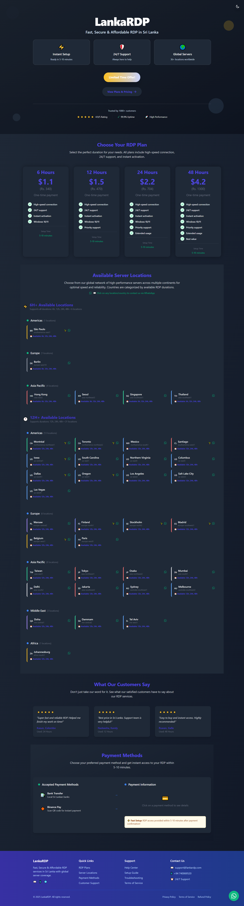

# 🌐 LankaRDP

**Fast, Secure & Affordable RDP in Sri Lanka**

LankaRDP is a modern website built using **HTML, CSS, JavaScript, and TailwindCSS** to provide high-performance Remote Desktop (RDP) services. Customers can instantly purchase RDP access, view global server locations, and get 24/7 support.

---

## 🛠️ Tech Stack

- **Frontend:** HTML, CSS, JavaScript
- **Styling:** TailwindCSS
- **Animations & UI Enhancements:** JavaScript
- **Hosting:** GitHub Pages

---

## ✨ Features

- ⚡ **Instant RDP Setup** – Ready within 5–10 minutes
- 🛡️ **24/7 Support** – Always here to help
- 🌍 **Global Server Coverage** – 36+ locations worldwide
- ⭐ **Trusted by 1000+ Customers**
- ✅ **99.9% Uptime Guarantee**
- 💳 **Multiple Payment Methods** – Bank Transfer & Binance Pay

---

## 📸 Preview



[🔗 Live Demo](https://lankardp.xyz)

---

## 📂 Project Structure

```bash
LankaRDP/
├── index.html        # Main entry page
├── styles.css        # Custom styles (if any)
├── script.js         # JavaScript functionality
├── /assets           # Images, icons, screenshots
└── /dist             # Tailwind build output (if using CLI build)
```

---

## 🚀 Getting Started

### 1. Clone the repository

```bash
git clone https://github.com/dimuthadithya/lankardp.git
cd LankaRDP
```

### 2. Install TailwindCSS (if modifying styles)

```bash
npm install -D tailwindcss
npx tailwindcss init
```

### 3. Run Tailwind build watcher

```bash
npx tailwindcss -i ./styles.css -o ./dist/output.css --watch
```

### 4. Open in browser

Simply open `index.html` in your browser or host it on GitHub Pages.

---

## 📞 Contact & Support

- 📧 Email: **[support@lankardp.com](mailto:support@lankardp.com)**
- 📱 WhatsApp: **+94 740069520**
- 🌐 Website: [LankaRDP](https://lankardp.xyz)

---

© 2025 **LankaRDP** – Fast, Secure & Affordable RDP Services in Sri Lanka.
